# daily_planner

A daily planner app is an app that helps you get organized and keeps all of your daily tasks

-Technologies used :

1-flutter .
2-dart .
3-bloc pattern .
4-repository.
5-dependency injection.
6-firebase authentication.
7-firestore database.
8- firebase storage.

These are some screenshots about my app, you can see all the screens by opening the appUi folder. 

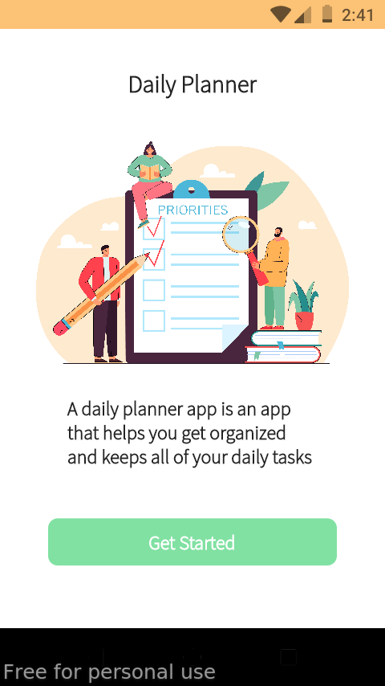
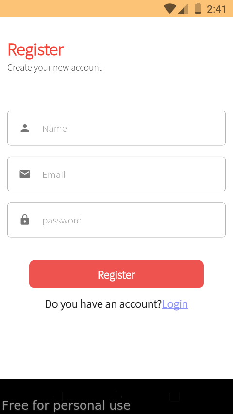
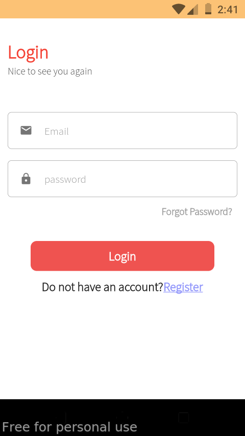
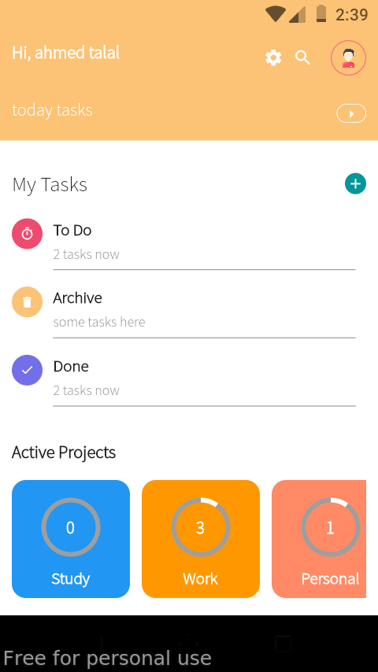
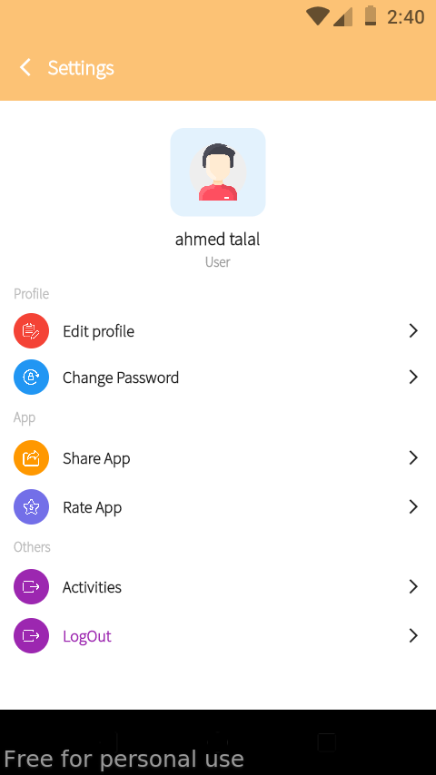
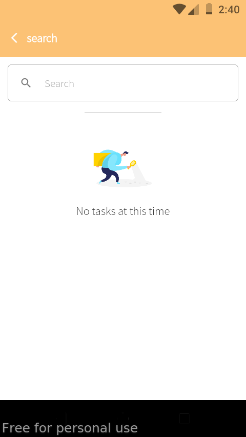
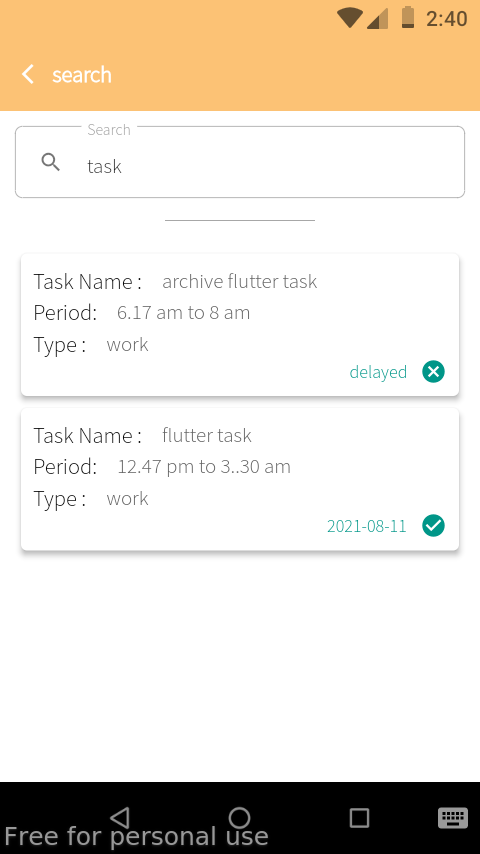
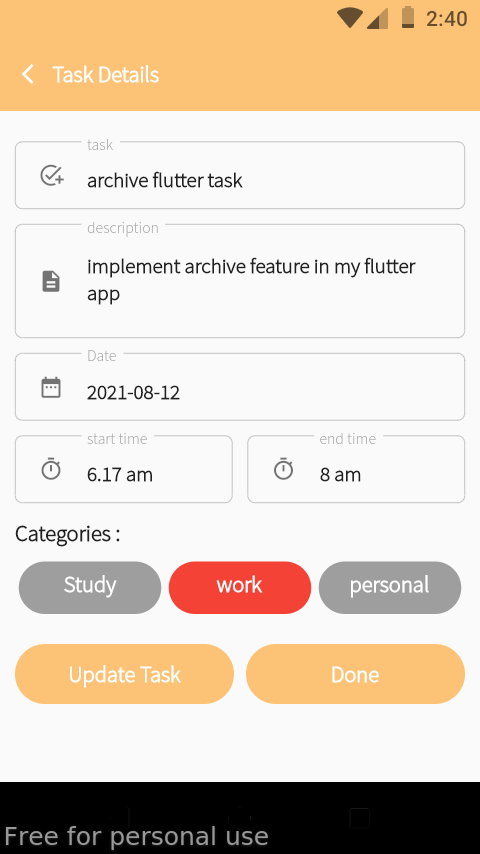
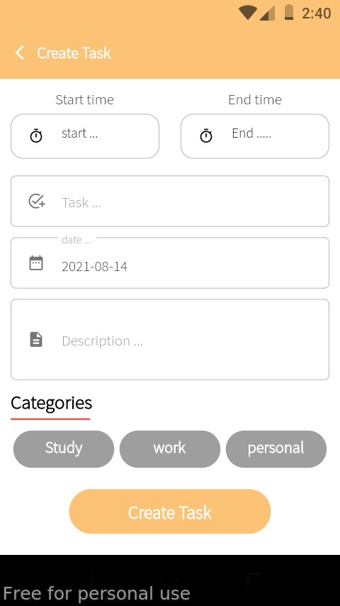
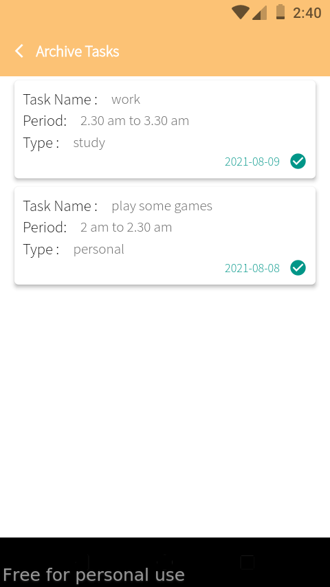
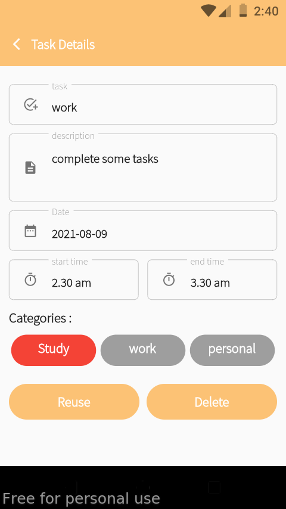
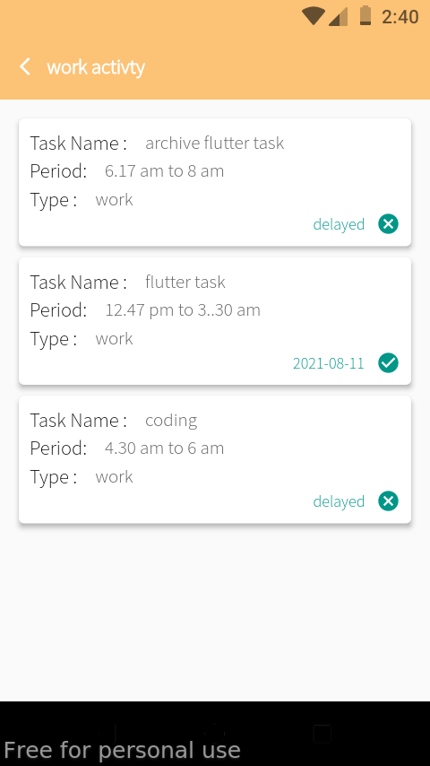
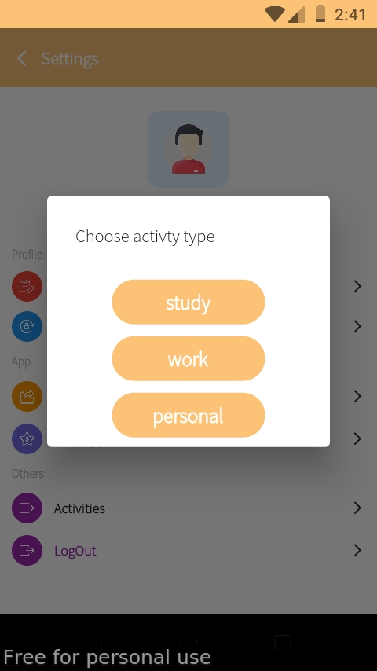
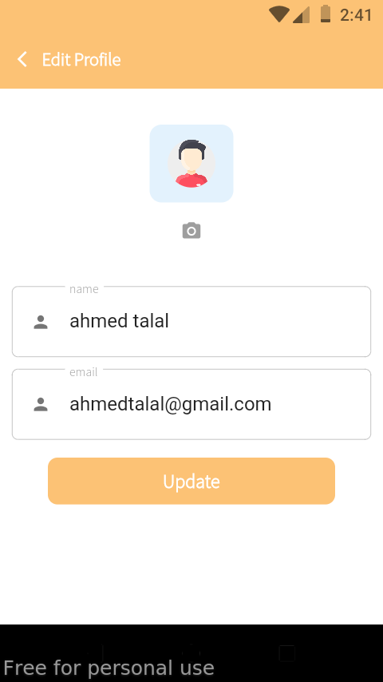